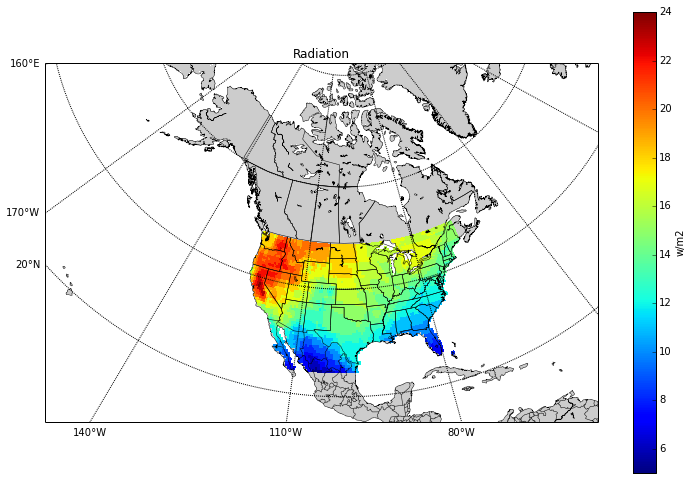

# Tutorial: Access Distributed NASA Earth Science Data from OPeNDAP Services using Python
## Analyze the difference of radiation between January and July
*Author: Angie Wei, Yaxing Wei*
 
*Date: March 9, 2018*
 
*Contact for [ORNL DAAC](https://daac.ornl.gov/): uso@daac.ornl.gov*

##### Keywords: OPeNDAP, THREDDS, Python,climatology, radiation
## Overview
In this tutorial, we will explore how to use ORNL DAAC data from THREDDS Data Server through OPeNDAP protocol using python. THREDDS is a web server that provides direct access to scientific data sets and OPeNDAP is a protocol that allows access to remote data without having to download the data. This example uses spatial subset of data from the mean radiation variable of a global 30-year monthly climatology dataset. Python pydap module is used to access the data on THREDDS through OPenDAP protocol. The mean monthly radiation data is read and its attributes, dimensions and size are retrieved. Two subsets of radiation data in January and July are created, and the difference of radiation between these two months is calculated and plotted on map.  

## Source Data
Spatial and temporal subsets of mean monthly surface climate over global land areas, excluding Antarctica. In this example, radiation data is obtained from [this ORNL DAAC's THREDDS server.](https://thredds.daac.ornl.gov/thredds/catalog/ornldaac/542/catalog.html?dataset=542/climate6190_RAD.nc4) 
## Prerequisites:
Python 2.7 or greater. Python modules: `pydap`, `basemap`, `matplotlib`, `numpy`
